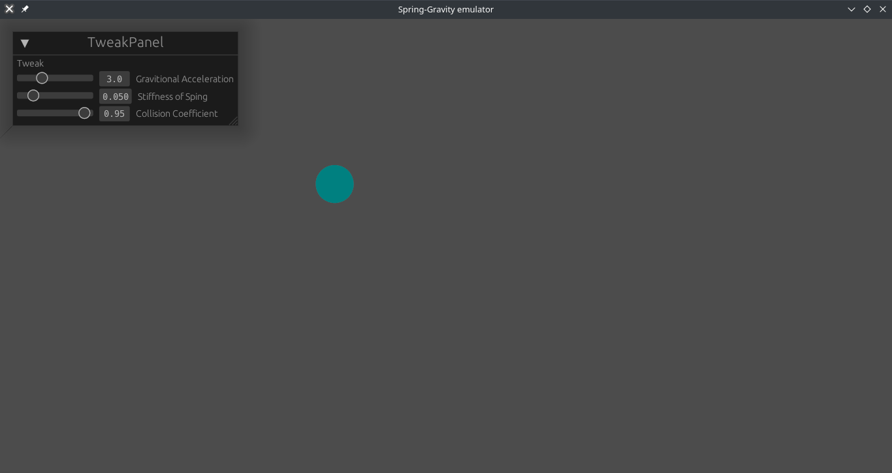

# Oscillatory Emulator

### Introduction

**This is an learning repository of [egui](https://github.com/emilk/egui) and [bevy](https://github.com/bevyengine/bevy)** 

A simple emulator that stimulates a ball in gravity field connected to a spring, written in rust.

---
### Build
You will need to have [Rust latest stable installed](https://doc.rust-lang.org/book/ch01-01-installation.html) to compiled it from the source.

If you are to compiling it on Linux platform, make sure that [Dependencies](docs/linux-dependencies.md) have been installed already.

```sh
$ cd oscillatory/
$ cargo build --release
```

---
### Demo




